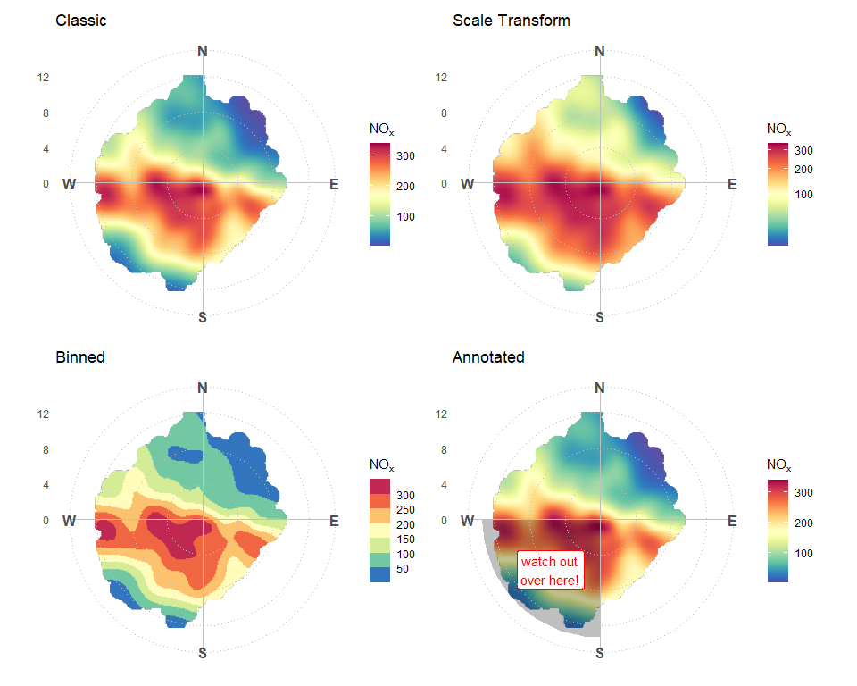

<!-- README.md is generated from README.Rmd. Please edit that file -->

# ggopenair

<!-- badges: start -->

[](https://CRAN.R-project.org/package=ggopenair)
[](https://github.com/jack-davison/ggopenair/actions/workflows/R-CMD-check.yaml)
<!-- badges: end -->

The goal of `ggopenair` is to bridge the gap between the data analysis
functions of `openair` and the flexibility of `ggplot2`. One of the key
strengths of `ggplot2` over `lattice` is that it allows plots to be
manipulated *after* they are created, which allows for a much more
flexible plotting experience. `ggplot2` is also being actively developed
and extended, which `ggopenair` can take advantage of.

## Installation

You can install the development version of ggopenair from
[GitHub](https://github.com/) with:

``` r
# install.packages("remotes")
remotes::install_github("jack-davison/ggopenair")
```

## Preview

A more thorough overview of `{ggopenair}` can be found on the package
website: <https://jack-davison.github.io/ggopenair/>.


