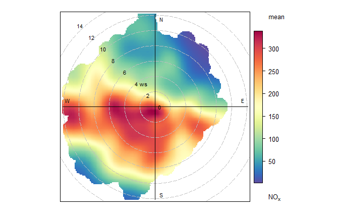
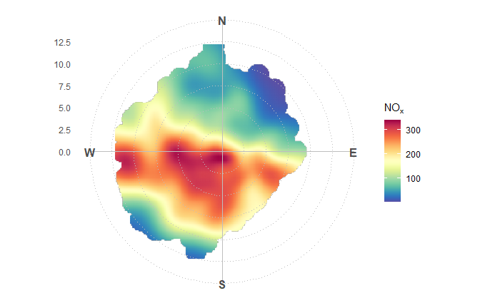
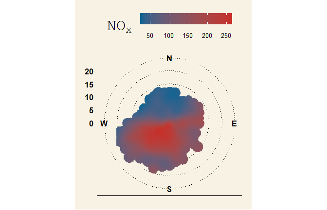
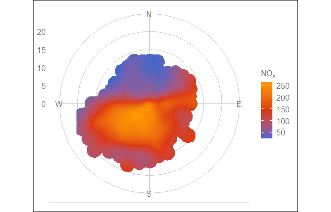
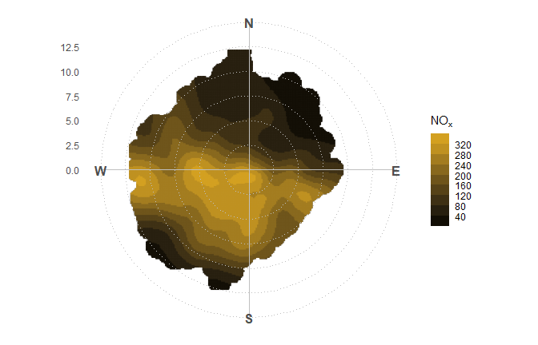
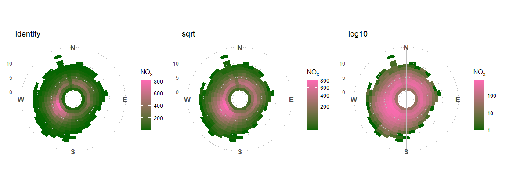
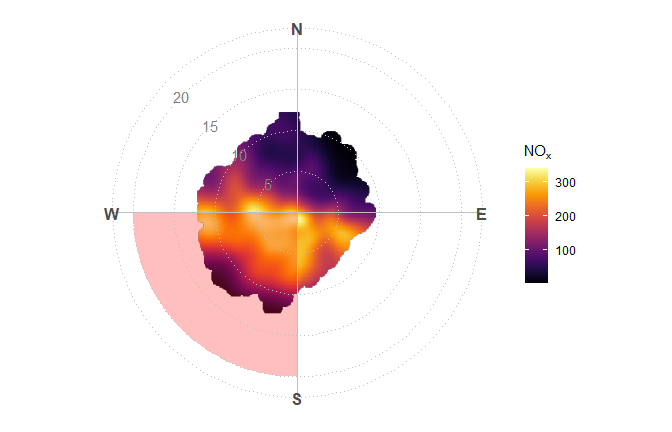
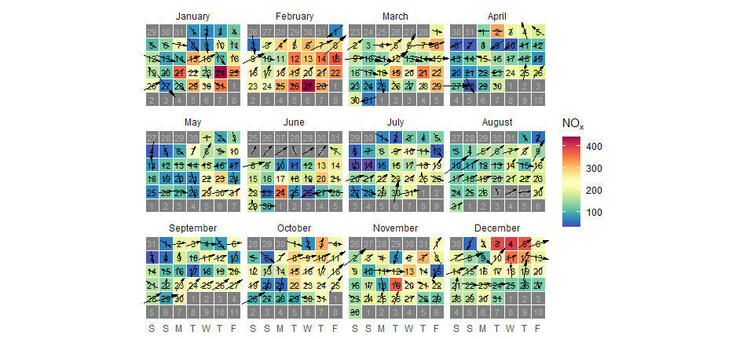
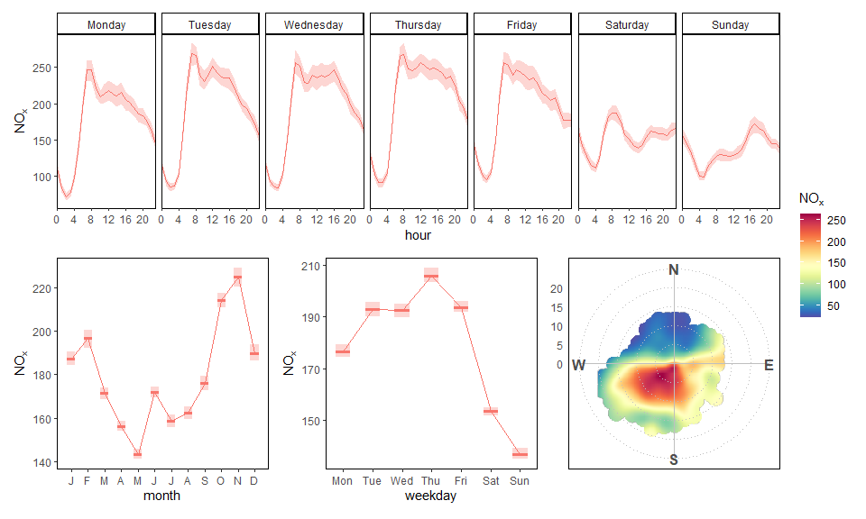

<!-- README.md is generated from README.Rmd. Please edit that file -->

# ggopenair

<!-- badges: start -->
<!-- badges: end -->

The goal of `ggopenair` is to bridge the gap between the data analysis
functions of `openair` and the flexibility of `ggplot2`. One of the key
strengths of `ggplot2` over `lattice` is that it allows plots to be
manipulated *after* they are created, which allows for a much more
flexible plotting experience. `ggplot2` is also being actively developed
and extended, which `ggopenair` can take advantage of.

## Installation

You can install the development version of ggopenair from
[GitHub](https://github.com/) with:

``` r
# install.packages("remotes")
remotes::install_github("jack-davison/ggopenair")
```

## Demonstration

### Introduction

An openair polar plot looks like this:

``` r
openair::polarPlot(ggopenair::marylebone)
```



To achieve the same result in `ggopenair` one would write:

``` r
library(ggopenair)
library(ggplot2)
#> Warning: package 'ggplot2' was built under R version 4.2.2

gg_polar_plot(marylebone, "nox") +
  theme_polar() +
  scale_opencolours()
```



This is more long winded, but the flexibility allows users to customise
their outputs very closely. For example:

### Custom Themes

Use `ggplot2::theme()` or any theme package. For example, we can use the
style from the Wall Street Journal:

``` r
gg_polar_plot(openair::mydata, "nox") +
  ggthemes::theme_wsj() +
  scale_color_gradientn(colours = rev(ggthemes::wsj_pal()(2))) +
  guides(color = guide_colorbar(barwidth = grid::unit(5, "cm")))
```



Or we could make our polar plot blend in with some other plots produced
in Google Sheets:

``` r
gg_polar_plot(openair::mydata, "nox") +
  ggthemes::theme_gdocs() +
  scale_color_gradientn(colours = ggthemes::gdocs_pal()(3))
```



### Scales

Use any `ggplot2` scale function to change how the plot behaves. For
example, use `scale_color_binned()` to bin the colour bar.

``` r
gg_polar_plot(openair::mydata, "nox") +
  theme_polar() +
  scale_color_steps(low = "black",
                             high = "goldenrod",
                             breaks = seq(0, 1000, 40))
```



Alternatively, one could use the “trans” argument to shift the colour
scale. This could be particularly useful for `gg_polar_freq()`, which
had its own “trans” argument in `openair`.

``` r
shift_axis <- function(trans) {
  gg_polar_freq(marylebone, "nox") +
    theme_polar() +
    scale_fill_gradientn(colours = c("darkgreen", "hotpink"),
                                   trans = trans) +
    labs(title = trans)
}

patchwork::wrap_plots(shift_axis("identity"),
                      shift_axis("sqrt"),
                      shift_axis("log10"))
```



### Annotations

Use `annotate()` to easily draw on your polar plots and to draw
attention to certain aspects. In-built annotation functions make it easy
to, for example, draw a highlighting wedge or direct axis labels.

``` r
gg_polar_plot(openair::mydata, "nox") +
  theme_polar() +
  scale_opencolours("inferno") +
  annotate_polar_wedge("S", "W") +
  annotate_polar_axis(seq(5, 20, 5), color = "grey50")
```



Calendar plots also possess their own dedicated annotation functions.

``` r
marylebone |>
  openair::selectByDate(year = 2019) |>
  gg_calendar("nox") +
  annotate_calendar_text("date") +
  annotate_calendar_wd(colour = "black") +
  scale_opencolours()
```



### Extension

Use any of the `ggplot2` extension packages out there, such as
`patchwork`. For example, a polar plot could be inserted into a time
variation plot.

``` r
library(patchwork)

polar <-
  gg_polar_plot(openair::mydata, "nox") + 
  theme_polar() + 
  theme(panel.border = element_rect(fill = NA, color = "black")) +
  scale_opencolours()

tv <- gg_timevariation(openair::mydata, "nox", return = "list")
tv <- purrr::map(tv, ~.x + theme_classic() + theme(legend.position = "none", panel.border = element_rect(fill = NA)))

tv$day_hour / (tv$month | tv$day | polar) +
  plot_layout(heights = c(.8, 1), guides = "collect")
```


